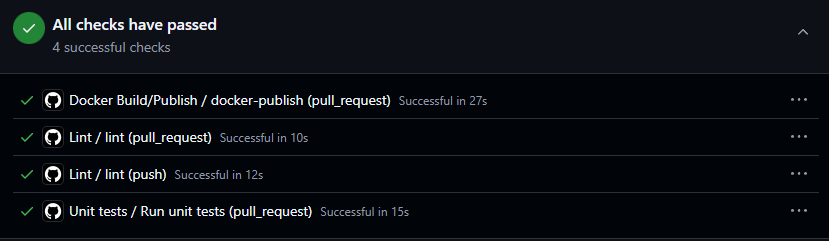

# Rapport – Laboratoire 0

Nom : Samuel RICHARD

Code permanent : RICS10049804

Cours : LOG430 – Architecture Logicielle Session Été 2025

Groupe : 01

## Informations générales

Nom Github : Scirelgar

URL du dépôt GitHub/GitLab : <https://github.com/Scirelgar/LOG430-Laboratoires/>

URL du dépôt Lab0 : <https://github.com/Scirelgar/LOG430-Lab0.git>

## Auto-évaluation par section

### Structuration du dépôt

| Éléments | Oui | Non | Commentaire / Justification |
| --- | --- | --- | --- |
| Le fichier README.md est présent et complet | :white_check_mark: |  |  |
| Un fichier .gitignore pertinent est utilisé | :white_check_mark: |  | J'ai utilisé le template associé à python sur GitHub |
| Le dépôt présente une structure claire et logique | :white_check_mark: |  | La structure suit les bonnes pratiques de projets python, avec le choix de faire les tests à l'extérieur du code de l'application |

### Application minimale

| Éléments | Oui | Non | Commentaire / Justification |
| --- | --- | --- | --- |
| L’application fonctionne localement | :white_check_mark: |  |  |
| L’application affiche un message ou répond sur un port web | :white_check_mark: |  | En utilisant le serveur de développement de FastAPI |

### Tests unitaires

| Éléments | Oui | Non | Commentaire / Justification |
| --- | --- | --- | --- |
| Au moins deux tests unitaires sont présents | :white_check_mark: |  |  |
| Les tests passent avec succès | :white_check_mark: |  |  |
| Le framework de test est bien choisi et configuré | :white_check_mark: |  | Utilisation de `pytest` |

### Conteneurisation

| Éléments | Oui | Non | Commentaire / Justification |
| --- | --- | --- | --- |
| L’application est conteneurisée avec un Dockerfile | :white_check_mark: |  |  |
| L’image Docker fonctionne localement | :white_check_mark: |  |  |
| Un fichier .dockerignore est présent (si pertinent) | :white_check_mark: |  | Pour ignorer les fichiers pycache |

### Orchestration avec Docker Compose

| Éléments | Oui | Non | Commentaire / Justification |
| --- | --- | --- | --- |
| Un fichier docker-compose.yml permet de lancer l’application | :white_check_mark: |  |  |
| Les instructions sont claires pour lancer l’application | :white_check_mark: |  | Le README.md décrit deux méthodes d'installation et d'exécution |

### Intégration continue (CI/CD)

| Éléments | Oui | Non | Commentaire / Justification |
| --- | --- | --- | --- |
| Une pipeline CI/CD est configurée sur GitHub Actions ou GitLab CI | :white_check_mark: |  |  |
| L’étape lint fonctionne correctement | :white_check_mark: |  |  |
| L’étape test unitaire fonctionne correctement | :white_check_mark: |  |  |
| L’étape build Docker fonctionne correctement | :white_check_mark: |  |  |
| L’image est automatiquement poussée sur Docker Hub | :white_check_mark: |  | L'utilisation de l'action [`docker/build-push-action@v6`](https://github.com/marketplace/actions/build-and-push-docker-images) combine les deux étapes de build et de publication. |
| Une preuve d’exécution réussie de la pipeline est incluse | :white_check_mark: |  | Voir capture ci-après |

### Documentation

| Éléments | Oui | Non | Commentaire / Justification |
| --- | --- | --- | --- |
| Le README.md décrit le projet, les instructions de build et d’exécution | :white_check_mark: |  |  |
| Le fonctionnement de la CI/CD y est expliqué | :white_check_mark: |  |  |
| Les choix techniques sont justifiés | :white_check_mark: |  | Ci-dessous quelques références utilisées pour la structure de projet. |

#### Références

- [Tests outside application code](https://docs.pytest.org/en/7.1.x/explanation/goodpractices.html#tests-outside-application-code)
- [Testing FastAPI](https://fastapi.tiangolo.com/tutorial/testing/#using-testclient)

## Réflexion personnelle

**Qu’avez-vous appris dans ce laboratoire ?**  
Ayant déjà déployé des CI/CD en python auparavant, créer l'application de base et répondre aux exigences du laboratoire fût assez rapide. L'utilisation de Docker pour créer des images était nouveau pour moi et j'ai dû beaucoup parcourir la documentation pour comprendre comment construire une image convenablement. Il se trouve que simplement utiliser une image ne donne pas nécessairement une bonne intuition pour en construire une.

**Quels éléments vous ont posé le plus de difficulté ?**  

Écrire le fichier de configuration `compose.yaml`. Encore à l'heure actuelle je ne suis pas certain d'avoir bien saisi l'utilisation de ce fichier si tout ce qu'il accompli peut déjà être fait en CLI avec un Dockerfile.

**Que souhaitez-vous améliorer pour les prochains laboratoires ?**  

Le fichier `compose.yaml`. Il me semble que je pourrais encore mieux exploiter ce fichier dans le cadre d'un build, publication et même exécution.
